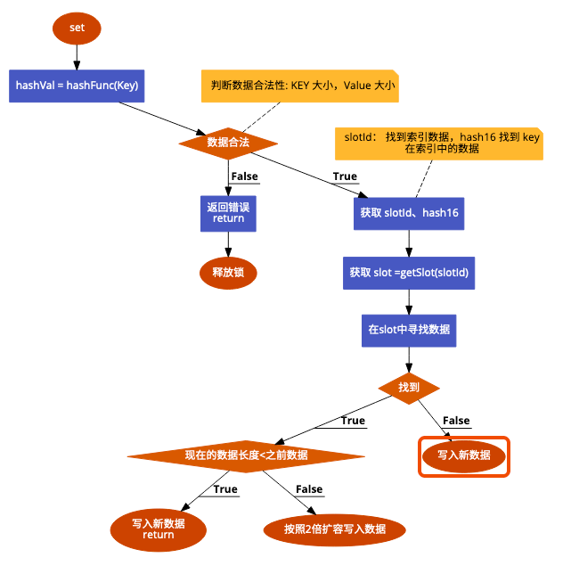

# freecache

## [freecache][1]

### 一句话描述

Go缓存库，具有零GC开销和高并发性能

### 简介

#### freecache是什么？

#### 为什么选择freecache？

* 支持存储大量数据条目
* **零 GC**
* 协程安全访问
* 过期时间支持
* **接近LRU**的淘汰算法
* 严格的内存使用
* 迭代器支持

### Example

```golang
package main

import (
	"fmt"
	"runtime/debug"

	"github.com/coocood/freecache"
)

func main() {
	// 缓存大小，100M
	cacheSize := 100 * 1024 * 1024
	cache := freecache.NewCache(cacheSize)
	debug.SetGCPercent(20)
	key := []byte("abc")
	val := []byte("def")
	expire := 60 // expire in 60 seconds
	// 设置KEY
	cache.Set(key, val, expire)
	got, err := cache.Get(key)
	if err != nil {
		fmt.Println(err)
	} else {
		fmt.Printf("%s\n", got)
	}
	fmt.Println("entry count ", cache.EntryCount())
	affected := cache.Del(key)
	fmt.Println("deleted key ", affected)
	fmt.Println("entry count ", cache.EntryCount())
}
```

freecache 有几个特点：**零 GC**，**接近LRU**的淘汰算法，迭代器支持
我们将从源码分析、核心的存储结构来分析他是怎么实现的

### 核心的存储结构

```golang
package freecache

import (
	"sync"
)

const (
	segmentCount = 256
)

// Cache is a freecache instance.
type Cache struct {
	locks    [segmentCount]sync.Mutex
	segments [segmentCount]segment // 256个 segment， segment实际存储数据的结构
	// segment 里面有一个 环形数组，环形数组的大小按照 size/segmentCount 来确定
}

type segment struct {
	rb  RingBuf // 实际数据存储的数组
	slotsData  []entryPtr // 数据索引地址，用于定位到具体的数据在数组中的位置
	...
}

// entryPtr 索引
type entryPtr struct {
	offset   int64  // 数据在环形数组中的偏移量
	hash16   uint16  
	keyLen   uint16 
	reserved uint32
}

// RingBuf 存储实际数据
type RingBuf struct {
	begin int64 
	end   int64 
	data  []byte
	index int 
}

// RingBuf 中的数据头, 这个记录的是
type entryHdr struct {
	accessTime uint32
	expireAt   uint32
	keyLen     uint16
	hash16     uint16
	valLen     uint32
	valCap     uint32
	deleted    bool
	slotId     uint8
	reserved   uint16
}
```

* 可以看到freecache将实际存储数据结构设计为数组，有segmentCount个读写锁 减小了锁的粒度，这样就大大降低了资源争抢
* freecache 减少了指针的使用，所以freecache的对GC开销几乎为零。


#### 结构图


### 流程分析

流程分析只是分析了了Set和淘汰算法的实现

#### Set

1. Set数据是会先计算出Key对应的hash值，这个数据在后面计算segID和slotId会使用到
2. 做一些数据合法的判断
3. 根据slotId找到slot
4. 根据slot和hash16获取到在KEY在slot中的index
5. 拿到index之后在cache中的RingBuf中查找数据
6. 找到的时候需要根据新旧两个数据长度判断是否需要扩容
7. 没有找到则直接写入新的数据
   

#### 淘汰算法的实现
freecache 的淘汰算法有两种实现：过期删除、**接近LRU**的淘汰算法

##### 过期删除

freecache的过期删除并不是有一个后台协程去删除，而是在Get的时候才会判断，这样可以减少锁的抢占

```golang
package freecache
// 发现是过期直接就返回ErrNotFound
if hdr.expireAt != 0 && hdr.expireAt <= now {
		seg.delEntryPtr(slotId, slot, idx)
		atomic.AddInt64(&seg.totalExpired, 1)
		err = ErrNotFound
		atomic.AddInt64(&seg.missCount, 1)
		return
}
```

#### **接近LRU**的淘汰算法

```golang
package freecache
// 如果过期
expired := oldHdr.expireAt != 0 && oldHdr.expireAt < now
// 近似LRU
leastRecentUsed := int64(oldHdr.accessTime)*atomic.LoadInt64(&seg.totalCount) <= atomic.LoadInt64(&seg.totalTime)
if expired || leastRecentUsed || consecutiveEvacuate > 5 {
    seg.delEntryPtrByOffset(oldHdr.slotId, oldHdr.hash16, oldOff)
if oldHdr.slotId == slotId {
    slotModified = true
}
consecutiveEvacuate = 0
atomic.AddInt64(&seg.totalTime, -int64(oldHdr.accessTime))
atomic.AddInt64(&seg.totalCount, -1)
seg.vacuumLen += oldEntryLen
if expired {
    atomic.AddInt64(&seg.totalExpired, 1)
} else {
    atomic.AddInt64(&seg.totalEvacuate, 1)
}
```

* oldHdr.accessTime：entry最近一次访问的时间戳。
* seg.totalCount：RingBuffer中entry的总数，包括过期和标记删除的entry。
* seg.totalTime：RingBuffer中每个entry最近一次访问的时间戳总和。
* 所以 atomic.LoadInt64(&seg.totalTime)/atomic.LoadInt64(&seg.totalCount)表示RingBuf中的entry最近一次访问时间戳的平均值，
  当一个entry的accessTime小于等于这个平均值，则认为这个entry是可以被置换掉的。
  

### Doc

http://godoc.org/github.com/coocood/freecache

### 比较

#### 相似的库

* https://github.com/golang/groupcache
* https://github.com/allegro/bigcache
* https://github.com/coocood/freecache


[1]: https://github.com/coocood/freecache
